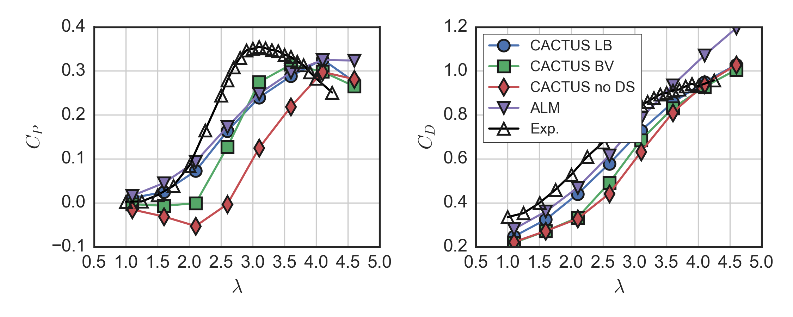
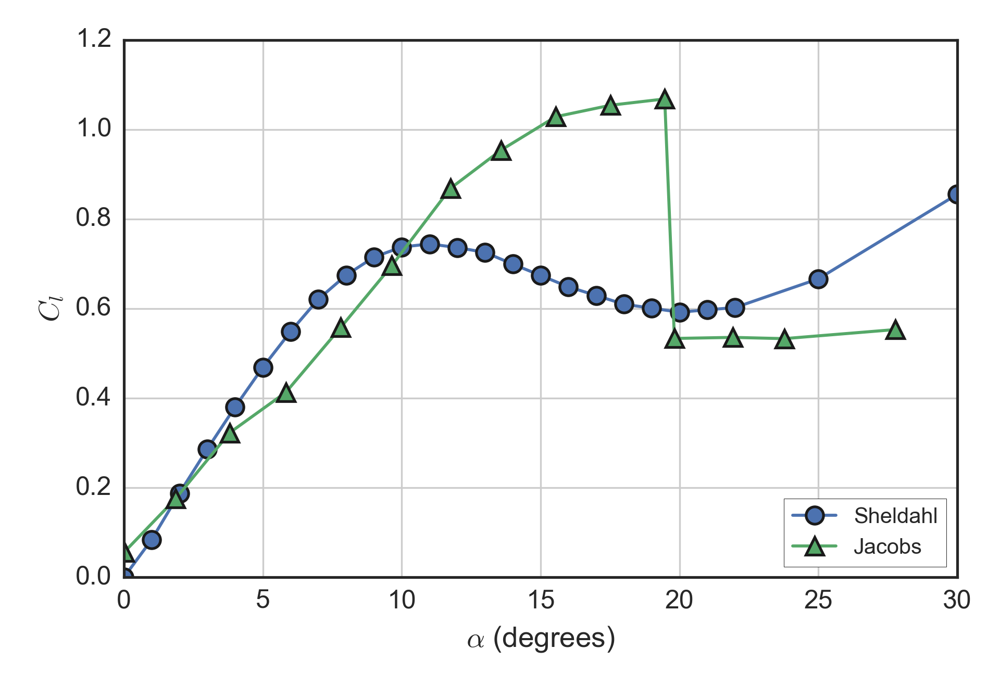

# Validation of a vortex line model for a medium solidity vertical-axis turbine

_Peter Bachant, Andrew Wilson, Phillip Chiu, Martin Wosnik, Vincent Neary_

## Abstract

_TODO: Write abstract._

## Introduction

To accelerate the development of marine hydrokinetic turbine technology, Sandia
National Laboratories (SNL) developed the Code for Axial and Cross-flow TUrbine
Simulation (CACTUS), based on Strickland's VDART model [@Strickland1981],
originally developed for SNL in the 1980s to aid in the design of Darrieus
vertical-axis wind turbines (VAWTs). Upgrades to CACTUS beyond VDART include
ground plane and free surface modeling, a new added mass correction, and a
Leishman--Beddoes (LB) dynamic stall (DS) model, in addition to that from
Boeing--Vertol (BV) [@Murray2011].

CACTUS was previously validated using experimental data from relatively low
solidity $\sigma = Nc/(2 \pi R)$ (or simply chord-to-radius ratio $c/R$)
rotors---the Sandia 5 m Darrieus ($c/R = 0.08$), 34 m Darrieus test bed ($c/R =
0.05$), and the VAWT 850 tapered H-rotor ($c/R = 0.05$). However, when applied
to a high solidity H-rotor, the UNH-RVAT, CACTUS significantly overpredicted
blade loading, and therefore mean performance coefficients [@Michelin2014]. It
was therefore of interest to validate CACTUS with a medium solidity
vertical-axis (a.k.a. cross-flow) turbine: the US Department of Energy (DOE)
Reference Model 2 (RM2).

The RM2 was the subject of an experimental investigation in the University of
New Hampshire (UNH) tow tank, where mechanical power output, overall streamwise
drag or thrust, and near-wake velocity were measured with a 1:6 scale physical
model. A Reynolds number dependence study was performed, which showed strong
$Re$-dependence below and weak $Re$-dependence above a chord-based Reynolds
number $Re_c \sim 10^5$ [@Bachant2016-RM2-paper].

### Objectives

In this study we sought to evaluate the effectiveness of the CACTUS vortex line
model for predicting the experimental performance results acquired for the 1:6
scale RM2 physical model experiments at UNH. Furthermore, we hoped to establish
some best practice guidelines for its application. In case performance
predictions were not adequate, a survey of static foil coefficient input data
was also performed.

## Methods

### Description of CACTUS

CACTUS assumes an incompressible potential flow field and uses a system of
constant-strength vortex filaments to model the unsteady rotor wake. Each blade
is modeled as a series of bound vortex filaments which span the blade's
quarter-chord line. The strength of each bound vortex is computed based on the
local velocity, and on the lift coefficient which is found from the local angle
of attack and a specified airfoil table. At each timestep, spanwise and trailing
vortices are shed from these bound vortices; their strengths are computed in
accordance with Helmholtz's circulation theorems. Each vortex filament induces a
velocity field, and each filament of the wake advects under the total velocity
influence of the wake system. Airfoil drag forces contribute to the blade and
rotor loads.

The influence of walls on the flow field is modeled using a system of
first-order constant strength quadrilateral source panels. The strengths of
these source panels are updated at each timestep to satisfy the no flow-through
condition at each panel's center. As with the vortex filaments representing the
wake, each source panel contributes to the velocity field, and thus the velocity
influence of the wall system influences both the local velocities along the
blade elements and the advection of the wake.

### Numerical setup

The 1:6 scale RM2 experiment performed in the UNH tow tank, for which the data
is available from [@Bachant2016-RM2-data], was replicated for a tow speed of 1
m/s, which corresponds to a turbine diameter Reynolds number $Re_D = 1.1 \times
10^6$. To match the experimental blockage ratio (10%), wall panel source
elements were added to the model, corresponding to the tank's 3.66 m wide by
2.44 m deep cross-section. Turbine rotor and wall geometry is shown in Figure 1.

Static foil coefficient data for the NACA 0021 profiles was taken from Sheldahl
and Klimas [@Sheldahl1981], as it is the only dataset for the moderate Reynolds
numbers simulated here. However, it is important to note that this dataset is
"semi-empirical" in that extrapolations were made for various profiles and
Reynolds numbers. Recently, Bedon et al. [@Bedon2014] showed with a double
multiple streamtube (DMST) momentum model that this dataset may be unreliable at
lower Reynolds numbers.

The model was run for eight revolutions, over the latter half of which
performance quantities were averaged.

## Results

### Verification

Sensitivity of the model results to the time step (or number of time steps per
revolution $N_t$) and number of blade elements was assessed, for which the
results are shown in Figure 2. Ultimately, the number of time steps per
revolution and number of elements per blade were chosen as 24 and 16,
respectively. These values may not indicate a typical "converged" configuration,
but were chosen for practicality, since the computational expense increases
about an order of magnitude when doubling $N_t$. For $N_t = 24$, the expense was
approximately 0.1 CPU hours per simulated second.

### Mean performance

The performance curve of the RM2 was simulated using both the Boeing--Vertol and
Leishman--Beddoes dynamic stall models, as well as with dynamic stall modeling
deactivated, and is shown in Figure 3. Dynamic stall has a very significant
deleterious effect on $C_P$ at the tip speed ratios of interest, and especially
at lower $\lambda$. The LB and BV DS models produce relatively similar results,
though the BV performance predictions at lower tip speed ratios do not match the
experiments as well as the LB results do.

### Near-wake mean velocity

To predict the interactions of turbines within arrays and with the
environment...

Potential flow methods such as that used here may not be as useful when
predicting the evolution of the wake since they do not model nonlinear advection
or turbulent transport---as higher fidelity Navier--Stokes models would---but
adequate resolution of the near-wake mean velocity field may help determine
optimal layouts for tightly spaced cross-flow turbine arrays.

_TODO: Write section on wake results._

### Static foil data comparison

Since there were significant discrepancies between the CACTUS results and
experiments---and also for the ALM using the same static foil data---a
comparison of the lift and drag coefficients was made at $Re_c = 1.5 \times
10^6$, shown in Figure 4. Note once again that this Reynolds number is about an
order of magnitude higher than for the 1:6 scale RM2 experiment, though foil
data at lower $Re$ was not available. Four datasets were compared: Sheldahl and
Klimas, Gregorek [@Gregorek1989], Jacobs [@Jacobs1932], and one generated with
the XFOIL viscous panel code [@Drela1989] via QBlade [@Marten2013], for which
default settings were used.

In the unstalled regime, all datasets have similar lift slopes ($C_l$ vs.
$\alpha$) except for the measurements of Jacobs, which may be due to three
dimensional effects. The XFOIL data shows overprediction of lift at stall
compared with the two experimental (Gregorek, Jacobs) and one semi-empirical
datasets (Sheldahl). This overprediction would ultimately result in higher mean
performance for the RM2 when used in CACTUS, though this may not be physically
accurate, as the XFOIL panel method may not be considered reliable in the
post-stall regime.

The post-stall drag coefficients in the Sheldahl and Klimas dataset are
significantly higher than those measured by Gregorek and simulated with XFOIL.
However, this may not affect the results when using the LB DS model, since the
force coefficients are parameterized based on the trailing edge separation
point. For $C_d$ this parameterized force coefficient is then added to the
zero-lift drag coefficient, which is similar for all datasets considered.

The Reynolds number dependence of the CACTUS performance predictions was
assessed in a similar fashion as it was in the RM2 tow tank experiment---by
keeping the tip speed ratio constant at 3.1 and varying the free stream
velocity. In this case CACTUS was run using the Sheldahl and Klimas foil data at
higher Reynolds numbers than measured in experiment, the results from which are
shown in Figure 5. In accordance with the Bedon et al. [@Bedon2014] results
(obtained without dynamic stall modeling), the Sheldahl and Klimas data appears
to exaggerate the decrease in performance at low $Re$, though the results look
like they will converge at higher $Re$. This hints at the fact that the Sheldahl
and Klimas data may not be reliable at low $Re$. Unfortunately, experimental
static foil data does not exist or is very hard to find for a NACA 0021 at $Re
\sim 10^5, which precludes comparison.

The validity of the Sheldahl and Klimas dataset was assessed for a NACA 0018
airfoil at low Reynolds number---$Re_c=1.6 \times 10^5$ by comparing with the
wind tunnel data from Jacobs and Sherman [@Jacobs1937]. The results plotted in
Figure 6 show how in the attached regime both datasets agree well, but the stall
characteristic in the Sheldahl data appears to overestimate the detrimental
effects of separation on the lift coefficient. Though this data was not taken
for the same profile as the RM2 blades, it does imply that the static 0021 foil
data could be the cause of the discrepancies in predicted turbine performance,
which is reinforced by the aforementioned potential extrapolation of the
Reynolds number dependence plotted in Figure 5.

## Conclusions

_TODO: Finish conclusions._

CACTUS results with the LB DS model were similar to those from an actuator line
model, which implies the flow modeling is comparable to RANS, but the dynamic
stall modeling is likely in need of revision.
